# Terraforming Mars – UI Redesign

> **This is a fork** of [terraforming-mars/terraforming-mars](https://github.com/terraforming-mars/terraforming-mars).
> Game logic and cards are unchanged from the original. The fork only reworks the **player view UI**
> to make its design, layout and interaction clearer.

**Live demo:** [tm.baiz.org/demo](https://tm.baiz.org/demo/) – a screen viewer with screenshots of every view and game state, desktop, tablet and phone, in English and German.

### Kept up to date

- **Daily upstream merge:** every day at 15:45 (Berlin time) the latest changes from the original [terraforming-mars/terraforming-mars](https://github.com/terraforming-mars/terraforming-mars) are merged into this fork. Game logic, cards, bug fixes and new features come from the original; UI conflicts are resolved in favour of the fork's layout. The merge is only pushed when build, lint and all tests pass.
- **Screenshots refresh themselves:** after each merge, only the views affected by the changes are captured again and uploaded to the [demo page](https://tm.baiz.org/demo/). Each screenshot there shows the date it was taken.

### What this fork changes in the UI

- **Two columns** from a window width of 1400 px: game actions on the left; Mars, milestones, awards and log on the right. Mars stays visible while scrolling. A drag handle adjusts the column widths.
- **Mobile view** on touch devices and below 1400 px: one task at a time with a bottom navigation and a turn drawer that slides up. Mars without the ring, global parameters as bars. Phones in landscape show a hint to rotate the device.
- **Create game** with the settings as compact cards and the players in their own column. Only options that apply are shown (e.g. expansion options only for active expansions).
- **Game created** page with one link per player in their colour, copy and play buttons, and the game settings next to them.
- **Player list as a table:** current stock large, production next to it, steel and titanium value as a badge. Tags and scores follow as smaller counters.
- **Initial selection** with corporation, preludes and card purchase as side-by-side columns you can compare. A summary bar shows starting M€, purchase cost and what remains.
- **Hand cards** can be sorted by drag and drop. The order also applies in the build and sell dialogs. Active action cards get their own block above the hand.
- **Placing tiles:** a button enlarges Mars. After placing, it shrinks back with an animation.
- **Actions as tabs** with consistent buttons. Hints show e.g. the temperature before and after, or the number of oceans already placed. Attacks on players show tiles in the target player's colour.
- **Spectator view** in the same layout as the player view.
- **Game end** as a notice floating over Mars, followed by an automatic redirect to the results page.

## Screenshots

English UI. Desktop at 1920 px width, mobile on a 390 px phone. All views and states: [demo page](https://tm.baiz.org/demo/).

<table>
<tr><th>View</th><th>Desktop</th><th>Mobile</th></tr>
<tr>
<td><b>Create game</b><br>Settings as compact cards, players in their own column on the right. On phones the players come first and the create button sticks to the bottom.</td>
<td>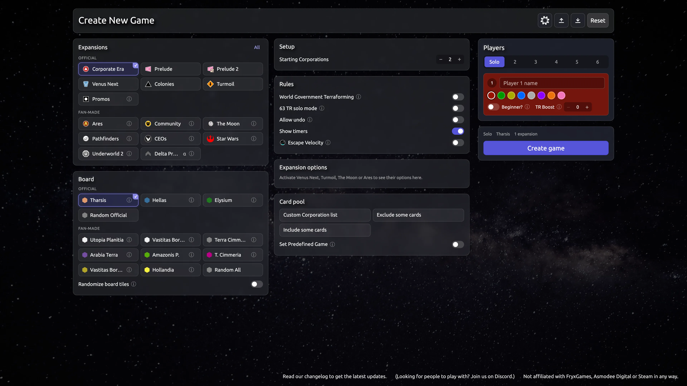</td>
<td>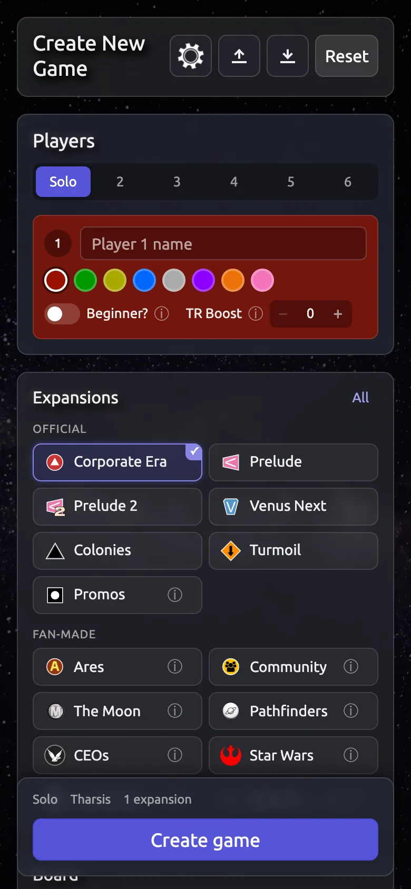</td>
</tr>
<tr>
<td><b>Game created</b><br>One link per player in their colour with copy and play buttons, game settings next to them.</td>
<td>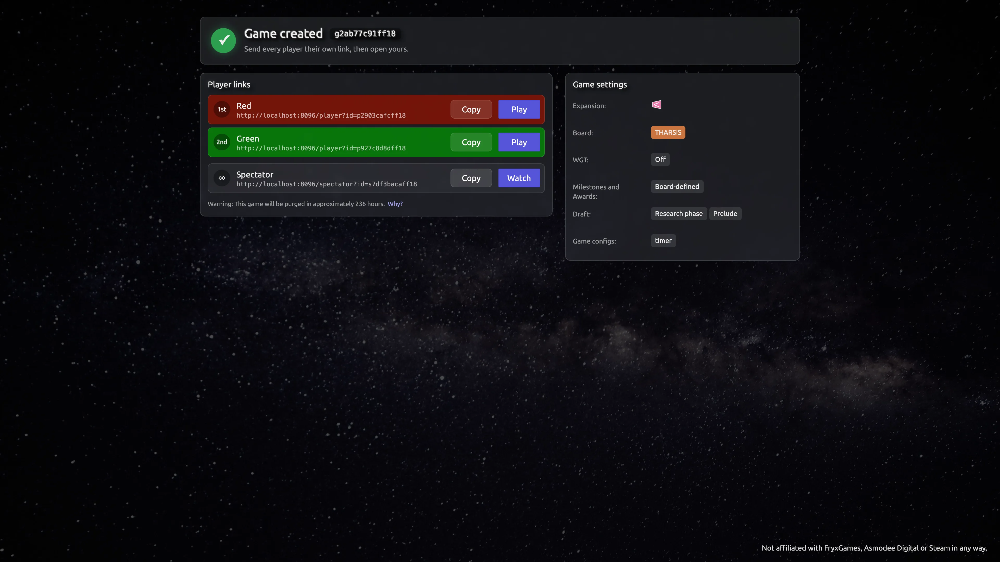</td>
<td>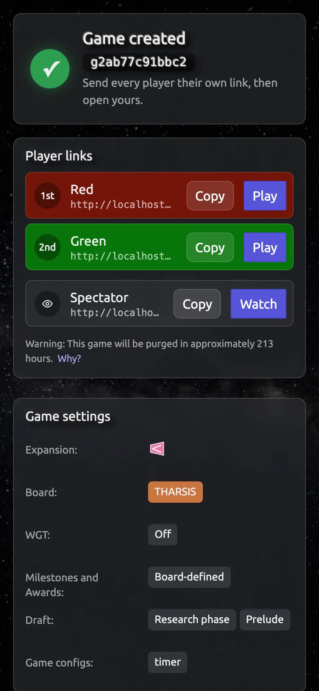</td>
</tr>
<tr>
<td><b>Initial selection</b><br>Corporation, preludes and card purchase side by side, with a summary bar and the start button.</td>
<td>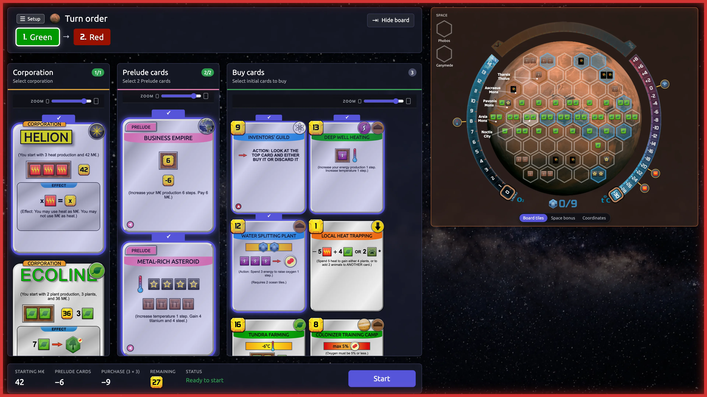</td>
<td>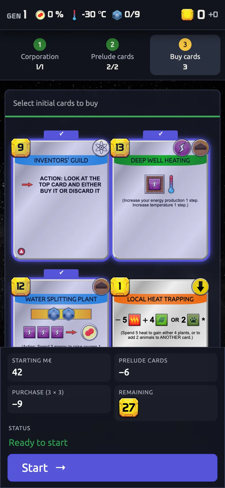</td>
</tr>
<tr>
<td><b>Mars</b><br>Desktop: two columns with Mars on the right. Phone: Mars without the ring; temperature, oxygen and oceans as bars below.</td>
<td>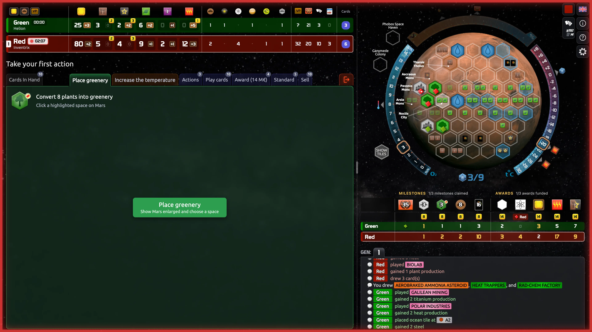</td>
<td>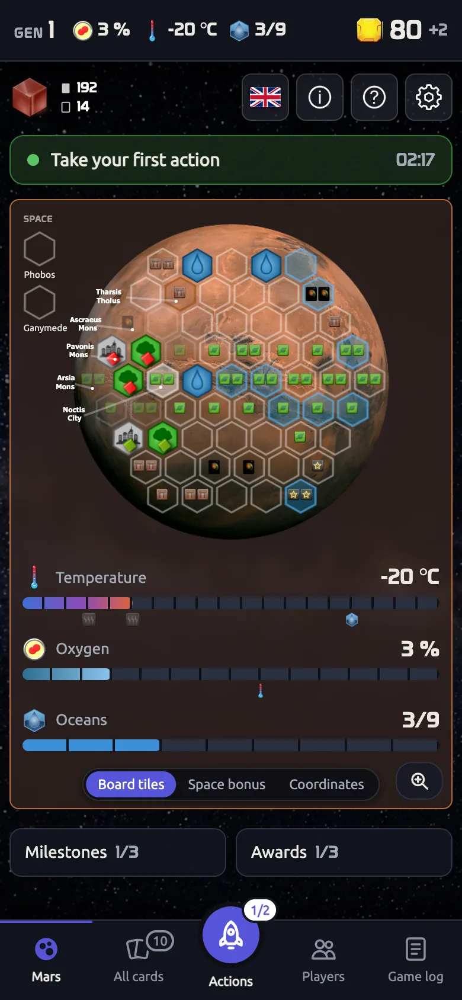</td>
</tr>
<tr>
<td><b>Hand</b><br>Active action cards above the hand. Cards can be sorted by drag and drop.</td>
<td>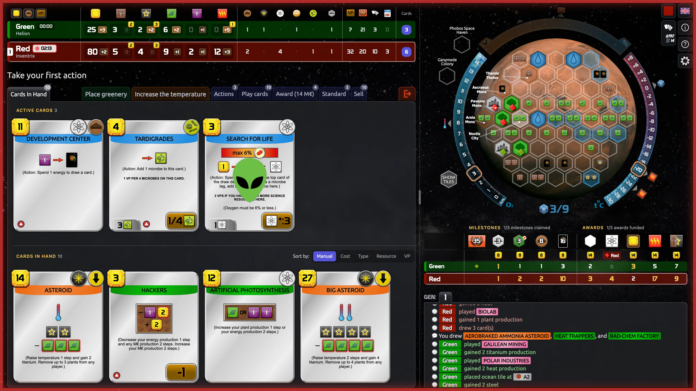</td>
<td>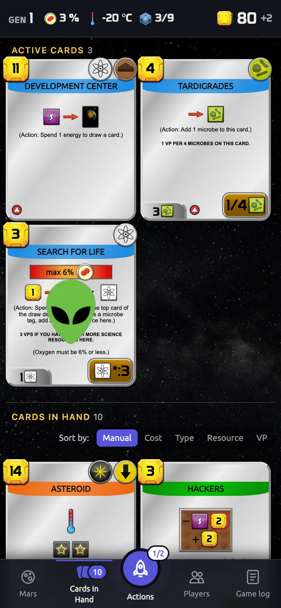</td>
</tr>
<tr>
<td><b>Players</b><br>Player table with stock and production. On phones in its own tab.</td>
<td>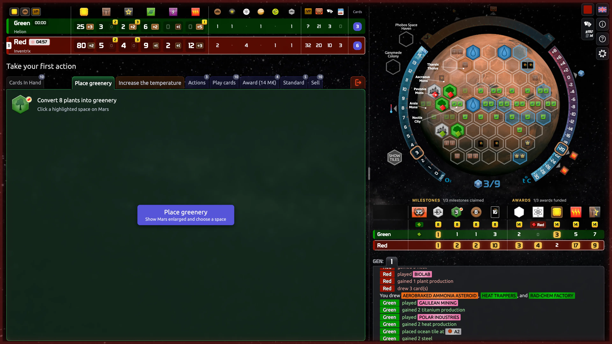</td>
<td>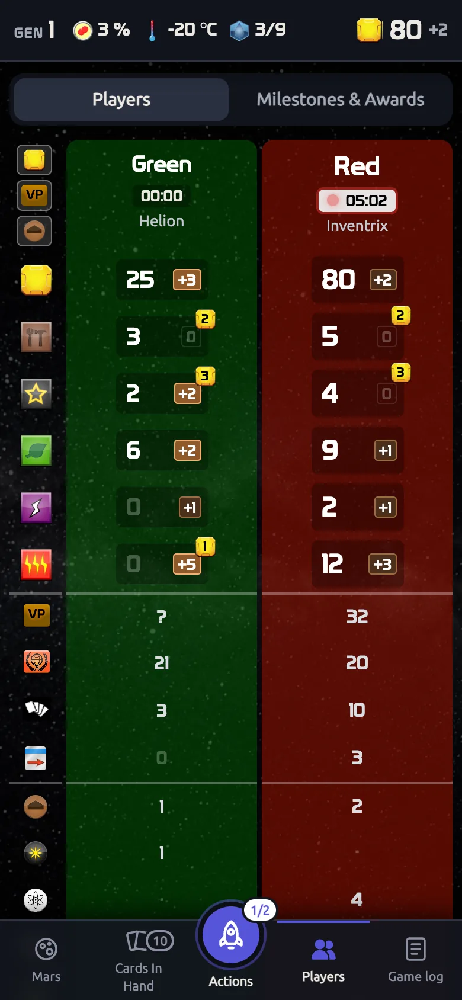</td>
</tr>
<tr>
<td><b>Playing a card</b><br>Card chosen, payment with M€, steel and titanium. On phones the cards are a carousel and the payment sits in the footer.</td>
<td>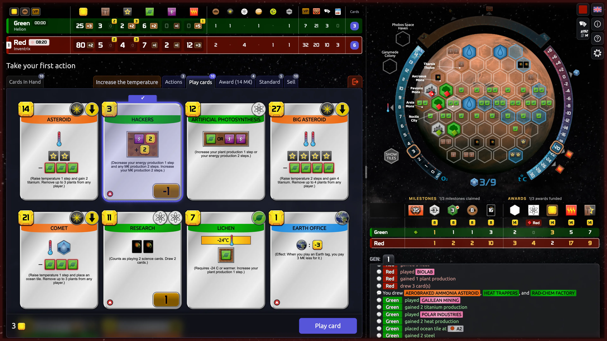</td>
<td>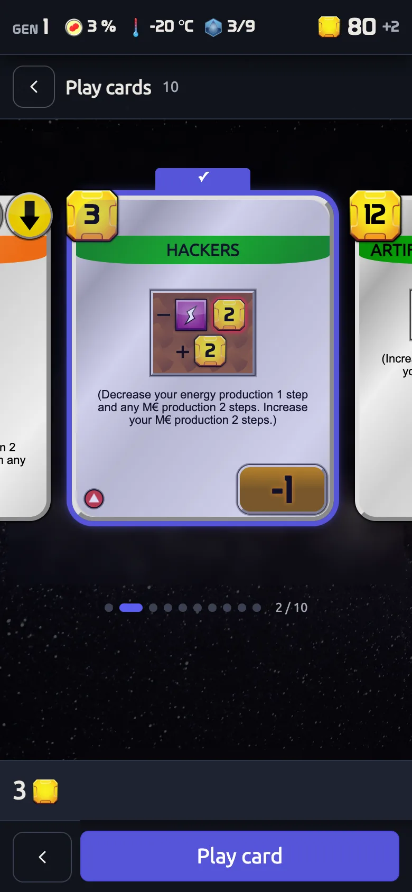</td>
</tr>
<tr>
<td><b>Placing a tile</b><br>Mars enlarged, a chosen space is confirmed before placing.</td>
<td>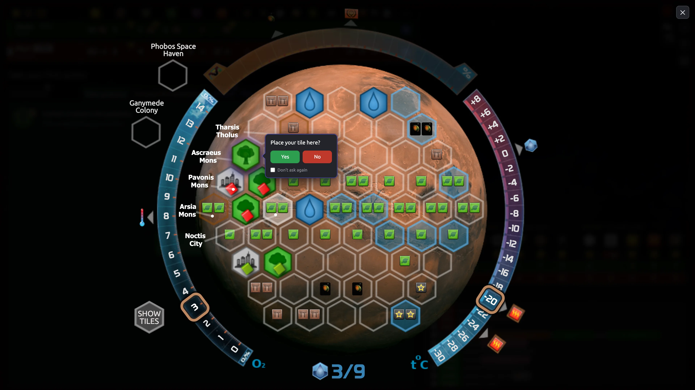</td>
<td>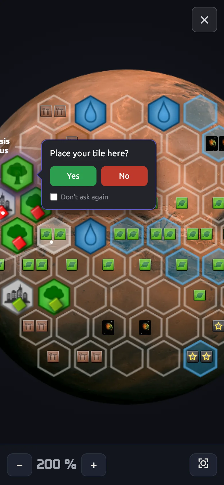</td>
</tr>
<tr>
<td><b>Log</b><br>Cards named in the log open in a large view; on phones as a carousel to swipe through.</td>
<td>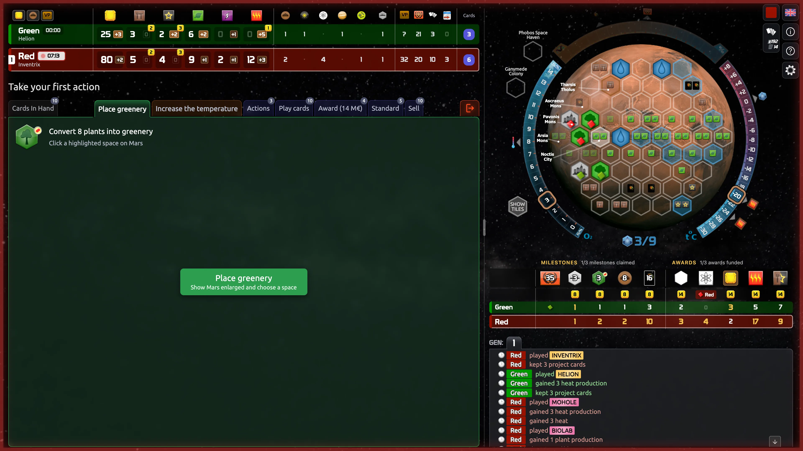</td>
<td>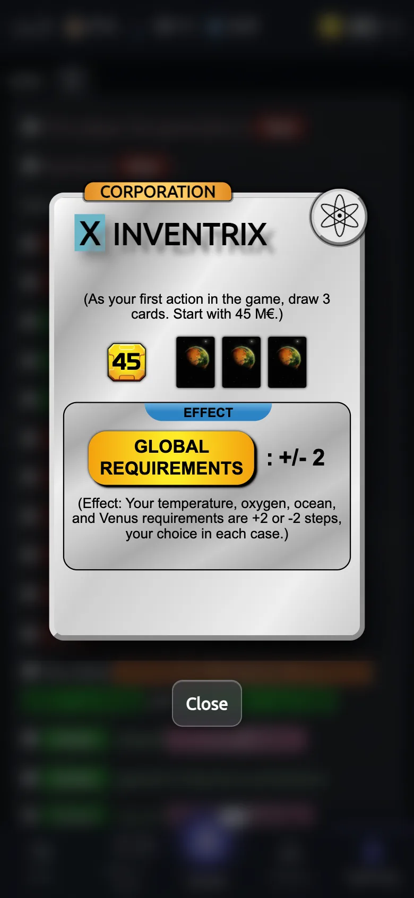</td>
</tr>
<tr>
<td><b>Results</b><br>Victory points, final board and point history.</td>
<td>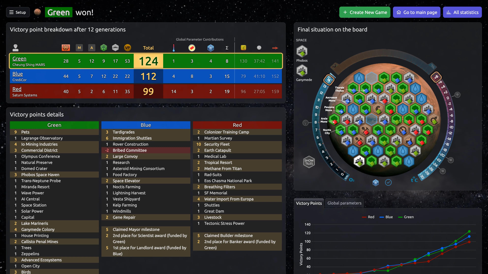</td>
<td>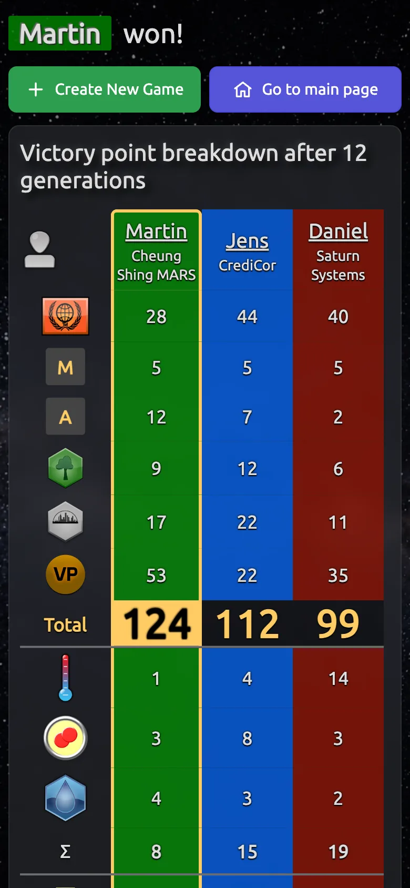</td>
</tr>
</table>

---

## Original and legal

- Game rules, cards, community and how to play: see the original [terraforming-mars/terraforming-mars](https://github.com/terraforming-mars/terraforming-mars) and [its wiki](https://github.com/terraforming-mars/terraforming-mars/wiki).
- Not affiliated with FryxGames, Asmodee Digital or Steam. The board game is great – please buy it.

## Running locally

### 1. Requirements

| Tool | Version | Note |
|---|---|---|
| [Git](https://git-scm.com/) | any | to clone the repository |
| [Node.js](https://nodejs.org/) | 24 (see `.nvmrc`), 22 works too | includes `npm`. With [nvm](https://github.com/nvm-sh/nvm): `nvm install && nvm use` in the project folder |
| Build tools | – | only needed if `npm ci` has to compile the SQLite driver (`better-sqlite3`) because no prebuilt binary fits your system. macOS: `xcode-select --install`. Debian/Ubuntu: `sudo apt install python3 make g++`. Windows: “Desktop development with C++” from the Visual Studio Build Tools |

No database server is needed: by default games are stored in a SQLite file.

### 2. Install and build

```bash
git clone https://github.com/wrybit/terraforming-mars.git
cd terraforming-mars
nvm use            # optional, picks the Node version from .nvmrc
npm ci             # installs the exact dependency versions from package-lock.json
npm run build      # CSS, card data, server (TypeScript) and client (webpack) – takes a few minutes
```

### 3. Start

```bash
npm start
```

The server prints `Starting server on port 8080`. Then:

1. Open <http://localhost:8080> and click **New game** (or go straight to <http://localhost:8080/new-game>).
2. Choose players and options, then **Create game**.
3. The *Game created* page shows one link per player. Open each link in its own browser tab or send it to the other players. Other devices in your network can join via `http://<your-computer's-IP>:8080`.

Stop the server with `Ctrl+C`. Games are kept in `db/game.db` and survive a restart.

### 4. Configuration (optional)

Copy the sample file and uncomment what you need:

```bash
cp .env.sample .env
```

| Variable | Default | Purpose |
|---|---|---|
| `PORT` | `8080` | port the server listens on (e.g. if 8080 is already in use) |
| `HOST` | all interfaces | e.g. `localhost` to block access from other devices |
| `LOCAL_FS_DB` | – | any value: store each game as a JSON file in `db/` instead of SQLite (handy for debugging) |
| `POSTGRES_HOST` | – | use PostgreSQL instead of SQLite, see the [Databases wiki page](https://github.com/terraforming-mars/terraforming-mars/wiki/Databases) |
| `SERVER_ID` | random | fixed passphrase for the admin pages |

All other options are explained in [`.env.sample`](.env.sample) and on the [dot-env wiki page](https://github.com/terraforming-mars/terraforming-mars/wiki/dot-env).

### 5. Development mode

Run `npm run build` once, then:

```bash
npm run dev
```

This starts the server and watchers for client code, styles and cards at the same time. The server restarts on changes; reload the browser to see client and style changes. Stop everything with `Ctrl+C`.

Checks before committing:

```bash
npm run lint       # ESLint, translation check, Vue type check
npm run test       # server tests (Mocha) and client tests (Vitest)
```

More in [CLAUDE.md](CLAUDE.md) (architecture, single test files) and the [development tips](https://github.com/terraforming-mars/terraforming-mars/wiki/Development-tips) of the original.

### Alternative: Docker

Needs only [Docker](https://docs.docker.com/get-docker/) with Compose, no Node.js:

```bash
git clone https://github.com/wrybit/terraforming-mars.git
cd terraforming-mars
docker compose up -d --build
```

The game runs on <http://localhost:8080>; games are kept in the Docker volume `tm-db`. Logs: `docker compose logs -f`, stop: `docker compose down`.

### Updating

```bash
git pull
npm ci
npm run build
npm start          # Docker: docker compose up -d --build
```

### Troubleshooting

- **`npm ci` fails at `better-sqlite3`** – wrong Node version or missing build tools, see step 1. After switching Node versions, delete `node_modules` and run `npm ci` again.
- **`EADDRINUSE: address already in use :::8080`** – another program uses the port. Start with `PORT=8081 npm start` or set `PORT` in `.env`.
- **Blank page or missing styles** – the build did not finish. Run `npm run build` again and check its output for errors.

## License

GPLv3, like the original (see [LICENSE](LICENSE)).

Fonts and icons from the original:

- Russian Prototype font: https://fonts-online.ru/fonts/prototype-rus-daymarius (copyright 2001, free for personal use)
- Polish Prototype font: https://www.gry-planszowe.pl/viewtopic.php?p=1489006#p1489006 (copyright 2001, free for personal use)
- Board Game Icons: http://www.kenney.nl/ (Creative Commons Zero, CC0)
