# Terraforming Mars – UI Redesign

A fork of [terraforming-mars/terraforming-mars](https://github.com/terraforming-mars/terraforming-mars) that reworks only the **player view UI**. Game logic and cards are unchanged.

**Showcase Gallery: [tm.baiz.org/showcase-gallery](https://tm.baiz.org/showcase-gallery/)** – screenshots of about 80 views, each on desktop, tablet and phone. See what the fork looks like before you install it.

Changes from the original are merged regularly. Afterwards the affected screenshots in the Showcase Gallery are updated automatically.

### What changes

- **Two columns** from 1400 px: actions left; Mars, milestones, awards and log right.
- **Mobile view** on touch devices and narrow windows: one task at a time, bottom navigation, turn drawer.
- **Create game** and **game created** pages with compact cards and one link per player.
- **Player table:** stock large, production next to it, tags and scores as small counters.
- **Initial selection:** corporation, preludes and cards side by side with a cost summary.
- **Hand cards** sortable by drag and drop; active action cards in their own block.
- **Actions as tabs** with consistent buttons and hints (e.g. temperature before/after).
- **Game end** as a notice over Mars, then redirect to the results.

## Screenshots

English UI. Desktop at 1920 px width, mobile on a 390 px phone.

<table>
<tr><th>View</th><th>Desktop</th><th>Mobile</th></tr>
<tr>
<td><b>Start page</b><br>Main menu with planet buttons and a short intro animation.</td>
<td>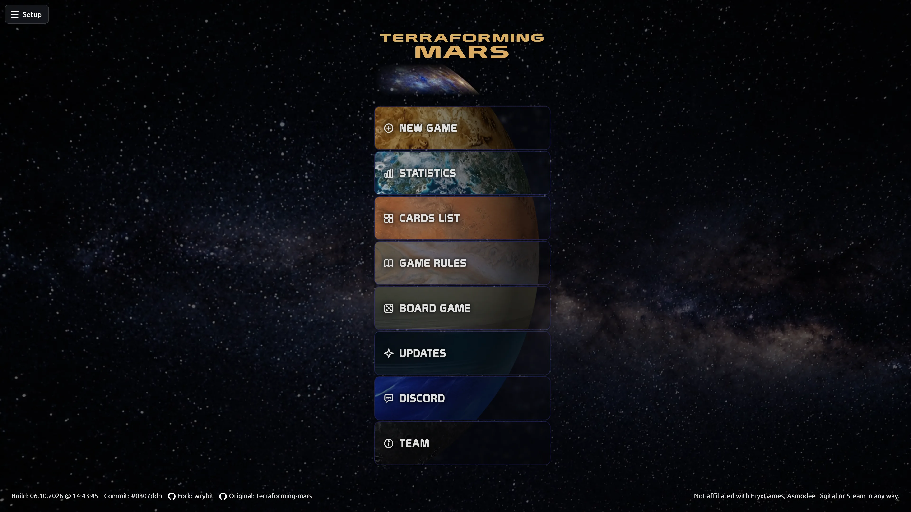</td>
<td>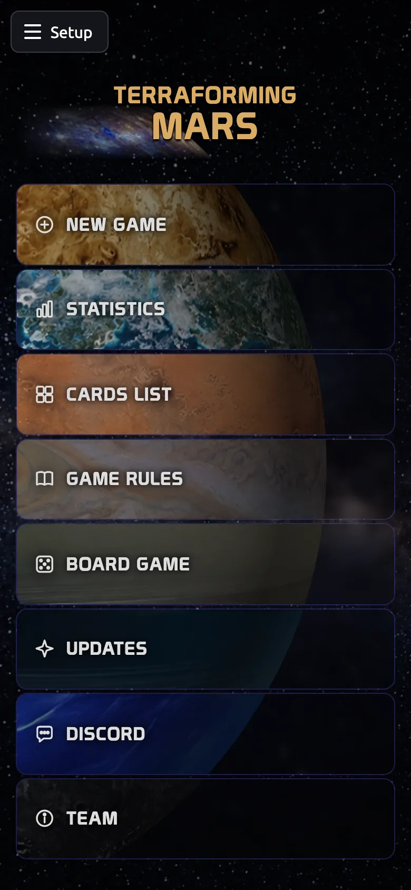</td>
</tr>
<tr>
<td><b>Card list</b><br>All cards with full-text search, filters and a price range.</td>
<td>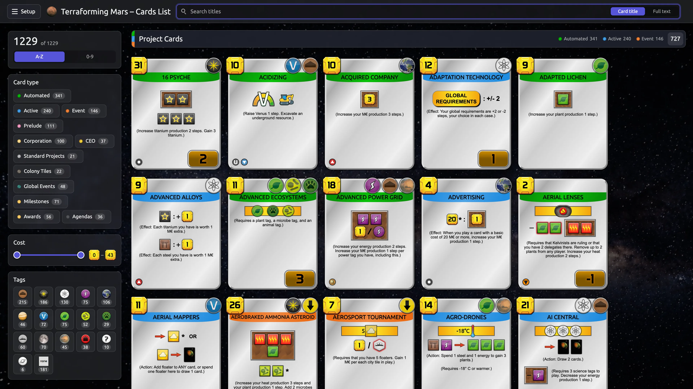</td>
<td>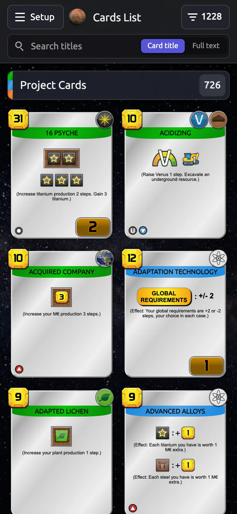</td>
</tr>
<tr>
<td><b>Initial selection</b><br>Corporation, preludes and card purchase side by side, with a summary bar and the start button.</td>
<td></td>
<td></td>
</tr>
<tr>
<td><b>Mars</b><br>Desktop: two columns with Mars on the right. Phone: Mars without the ring; temperature, oxygen and oceans as bars below.</td>
<td></td>
<td></td>
</tr>
<tr>
<td><b>All cards</b><br>Hand, actions and played cards in one tab, with one row for filter and sorting.</td>
<td>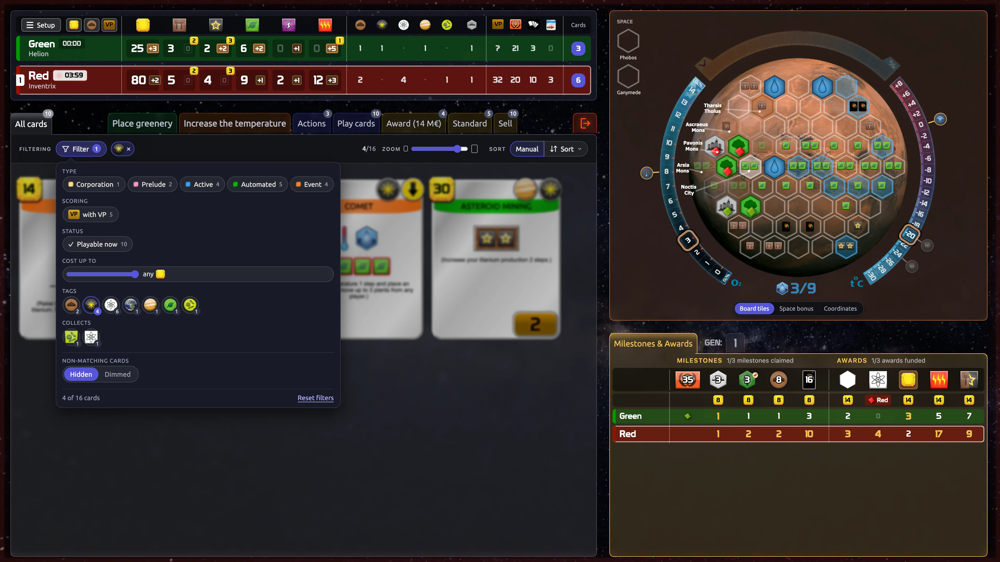</td>
<td>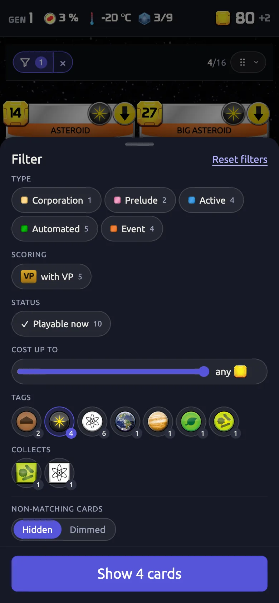</td>
</tr>
<tr>
<td><b>Colonies</b><br>Expansion boards as tabs above Mars – here the colonies with their trade fleets.</td>
<td>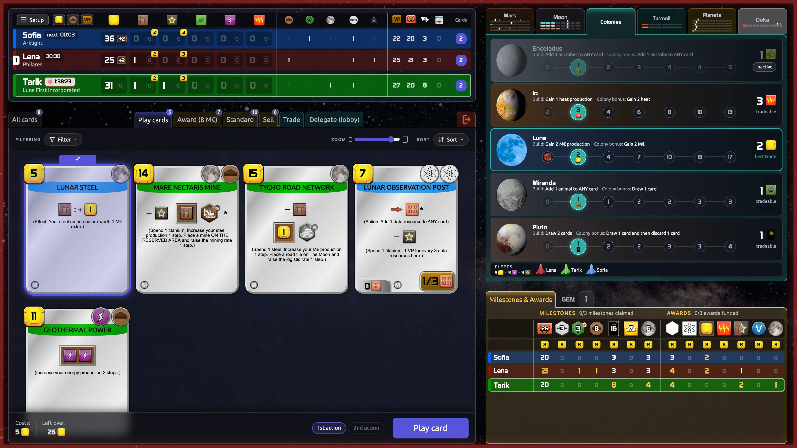</td>
<td>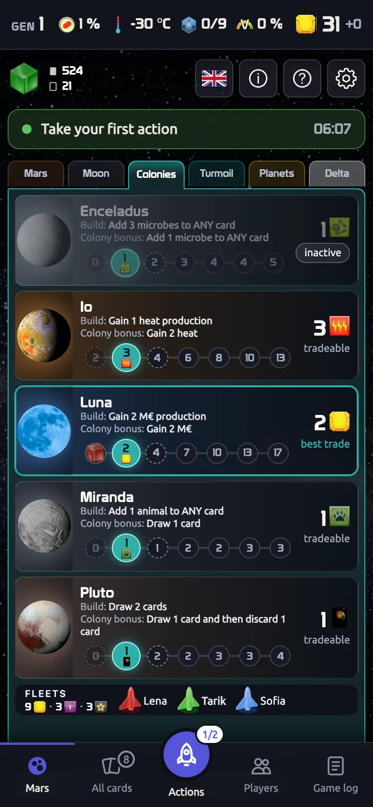</td>
</tr>
<tr>
<td><b>Turmoil</b><br>Parties as a hemicycle with leaders, chairman and the upcoming global events.</td>
<td>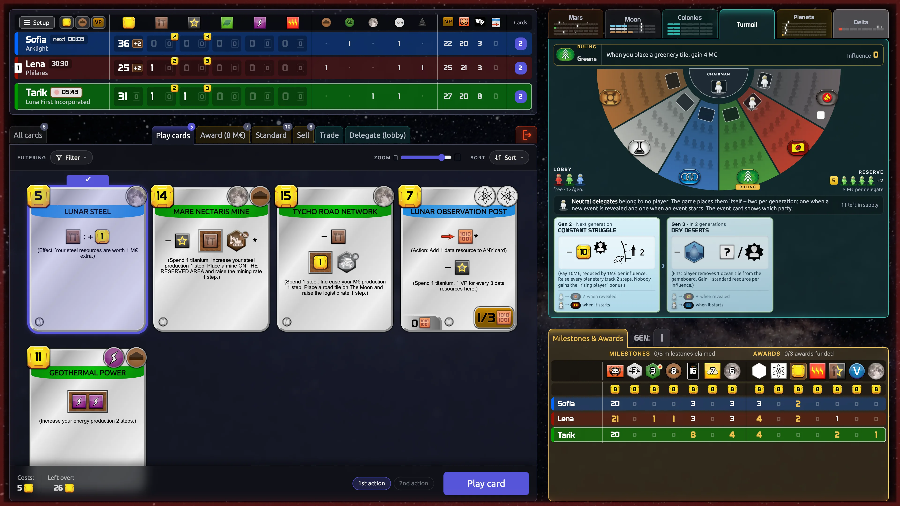</td>
<td>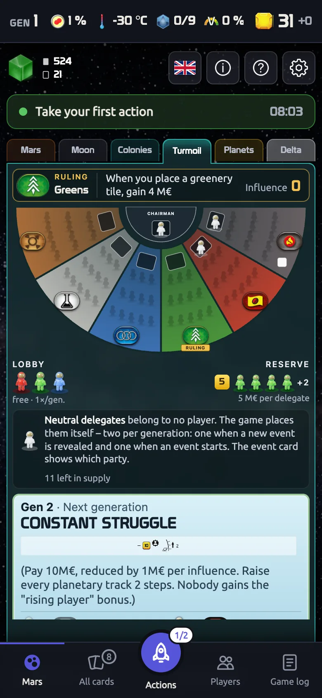</td>
</tr>
<tr>
<td><b>Statistics</b><br>Wins, corporations and boards across all games played on the server.</td>
<td>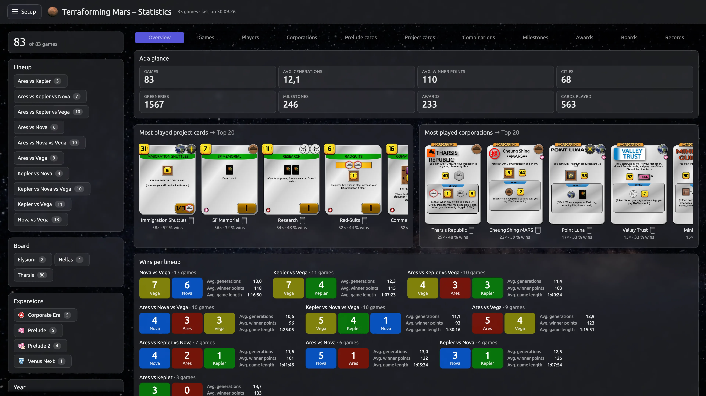</td>
<td>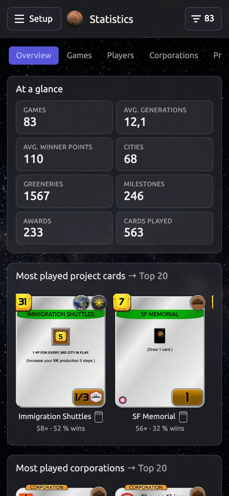</td>
</tr>
<tr>
<td><b>Results</b><br>Victory points, final board and point history.</td>
<td></td>
<td></td>
</tr>
<tr>
<td><b>Solo win</b><br>Solo games get their own end screens for victory and defeat.</td>
<td>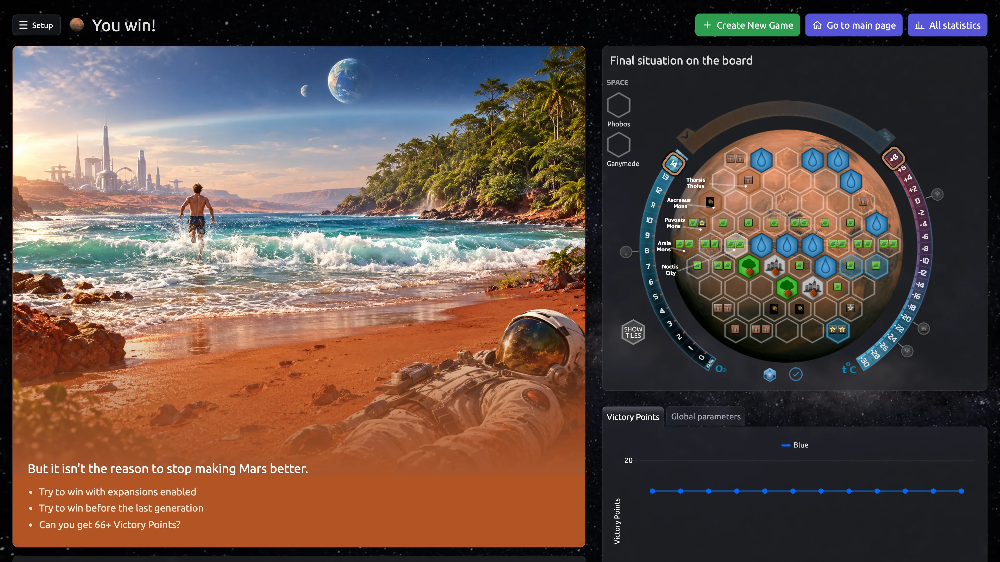</td>
<td>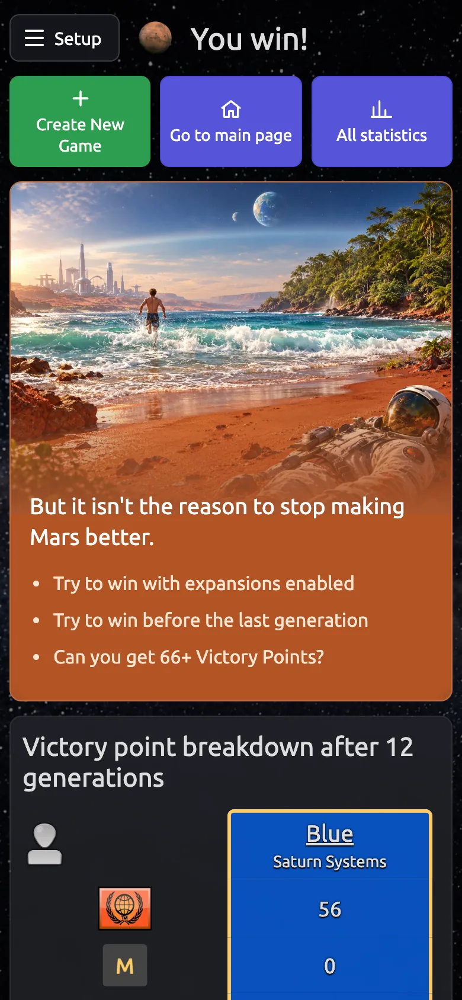</td>
</tr>
</table>

---

## Original and legal

- Game rules, cards, community and how to play: see the original [terraforming-mars/terraforming-mars](https://github.com/terraforming-mars/terraforming-mars) and [its wiki](https://github.com/terraforming-mars/terraforming-mars/wiki).
- Not affiliated with FryxGames, Asmodee Digital or Steam. The board game is great – please buy it.

## Running locally

Requirements: Git and [Node.js](https://nodejs.org/) 24 (see `.nvmrc`; 22 works too). No database server needed – games are stored in `db/game.db` (SQLite).

```bash
git clone https://github.com/wrybit/terraforming-mars.git
cd terraforming-mars
npm ci             # install dependencies
npm run build      # takes a few minutes
npm start
```

Open <http://localhost:8080>, click **New game**, create the game and open the player links. Other devices in your network can join via `http://<your-IP>:8080`.

- **Settings:** `cp .env.sample .env`, e.g. `PORT` or `LOCAL_FS_DB` (JSON files instead of SQLite). See [`.env.sample`](.env.sample).
- **Development:** after one `npm run build`, `npm run dev` rebuilds on every change. Checks: `npm run lint`, `npm run test`.
- **Docker** (no Node.js needed): `docker compose up -d --build`, then <http://localhost:8080>.
- **`npm ci` fails at `better-sqlite3`:** check the Node version; if needed install build tools (macOS `xcode-select --install`, Debian/Ubuntu `sudo apt install python3 make g++`).

## License

GPLv3, like the original (see [LICENSE](LICENSE)).

Fonts and icons from the original:

- Russian Prototype font: https://fonts-online.ru/fonts/prototype-rus-daymarius (copyright 2001, free for personal use)
- Polish Prototype font: https://www.gry-planszowe.pl/viewtopic.php?p=1489006#p1489006 (copyright 2001, free for personal use)
- Board Game Icons: http://www.kenney.nl/ (Creative Commons Zero, CC0)
