# Terraforming Mars – UI Redesign

> **This is a fork** of [terraforming-mars/terraforming-mars](https://github.com/terraforming-mars/terraforming-mars).
> Game logic and cards are unchanged from the original. The fork only reworks the **player view UI**
> to make its design, layout and interaction clearer.

### What this fork changes in the UI

- **Two columns** from a window width of 1400 px: game actions on the left; Mars, milestones, awards and log on the right. Mars stays visible while scrolling. A drag handle adjusts the column widths.
- **Player list as a table:** current stock large, production next to it, steel and titanium value as a badge. Tags and scores follow as smaller counters.
- **Initial selection** with corporation, preludes and card purchase as side-by-side columns you can compare. A summary bar shows starting M€, purchase cost and what remains. The board can be collapsed.
- **Hand cards** can be sorted by drag and drop. The order also applies in the build and sell dialogs. Active action cards get their own block above the hand.
- **Placing tiles:** a button enlarges Mars. After placing, it shrinks back with an animation.
- **Actions as tabs** with consistent buttons. Hints show e.g. the temperature before and after, or the number of oceans already placed.
- **Game end** as a notice floating over Mars, followed by an automatic redirect to the results page.

## Screenshots

Screenshots show the German UI at 1920 px width unless stated otherwise.

**Initial selection with preludes:** corporation, preludes and card purchase as columns, summary bar at the bottom.

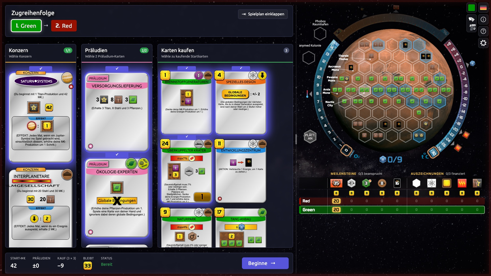

**Game view:** player table, actions as tabs, hand cards with active action cards above. On the right: Mars, milestones, awards and log.

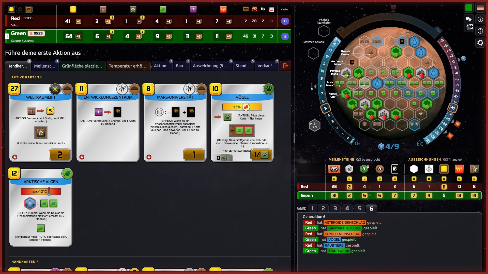

**Placing a tile:** the button names the tile and what happens next.

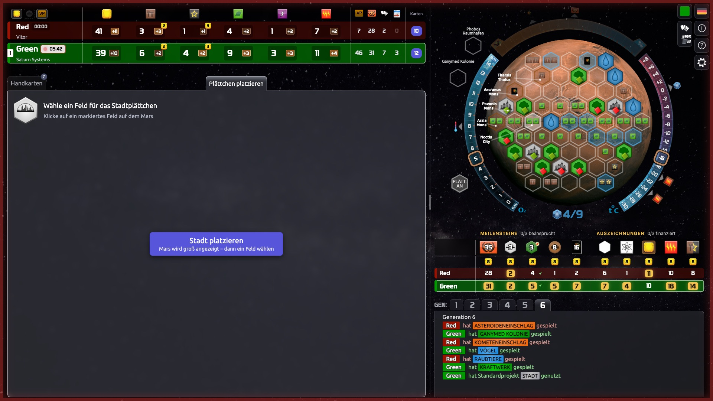

<<<<<<< Updated upstream
**Grünfläche platzieren:** Tab und Box in Grün.
=======
**Enlarged Mars:** one click enlarges Mars. A chosen space is confirmed before the tile is placed.

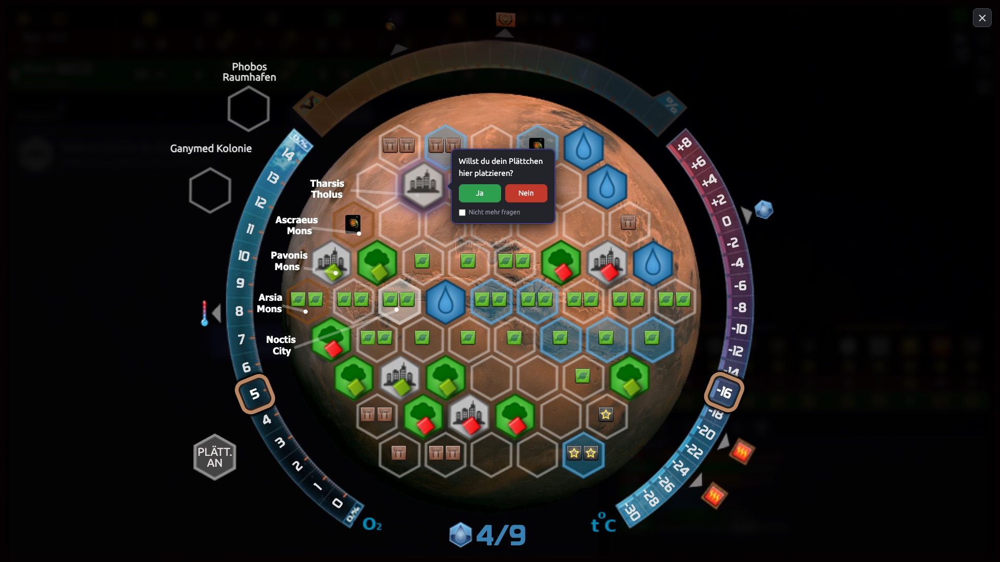

**Placing a greenery:** tab and box in green.
>>>>>>> Stashed changes

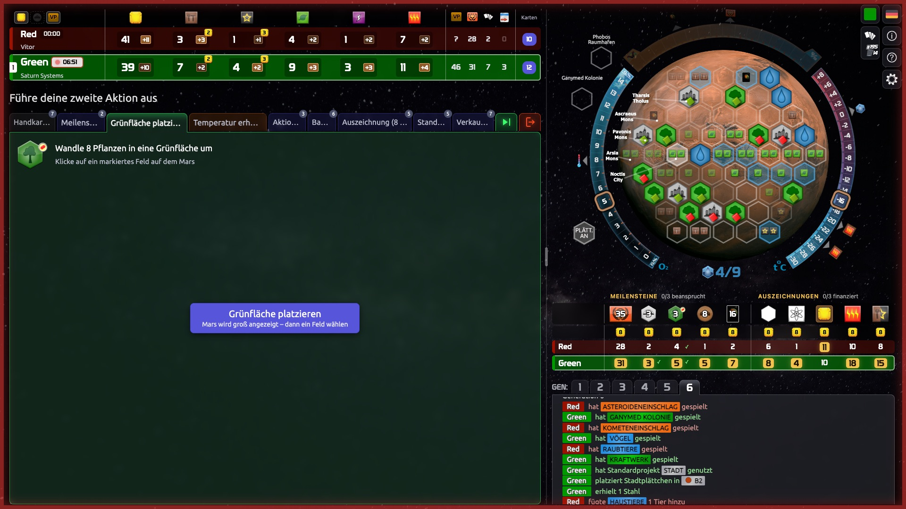

**Placing an ocean:** the hint shows how many oceans are already on Mars.

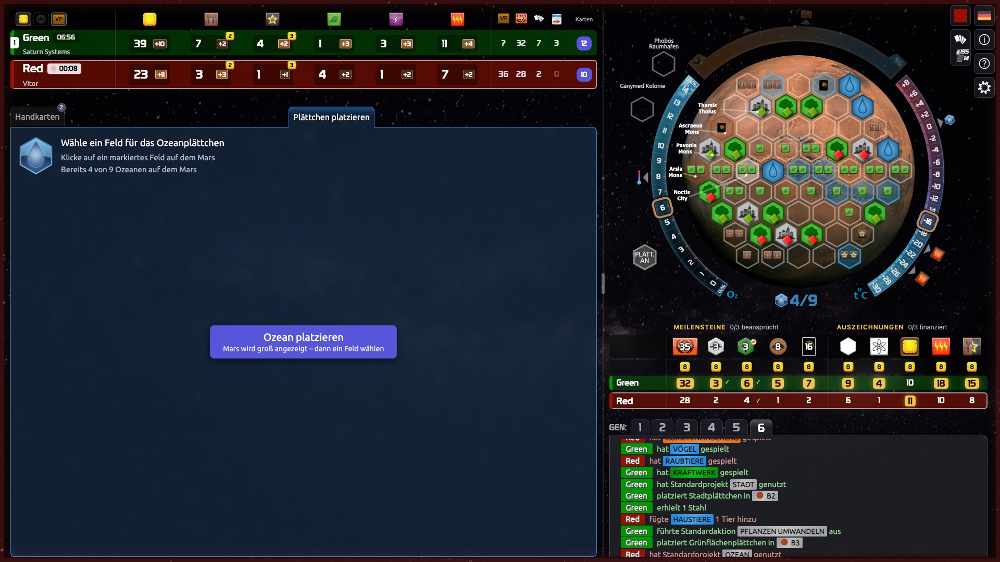

<<<<<<< Updated upstream
**Großer Mars:** Ein Klick vergrößert den Mars. Ein gewähltes Feld wird vor dem Setzen bestätigt.


**Gespielte Karten eines Spielers:** Ein Klick auf seine Zeile öffnet sie als Overlay über der rechten Spalte.
=======
**A player's played cards:** clicking their row opens them as an overlay over the right column.
>>>>>>> Stashed changes

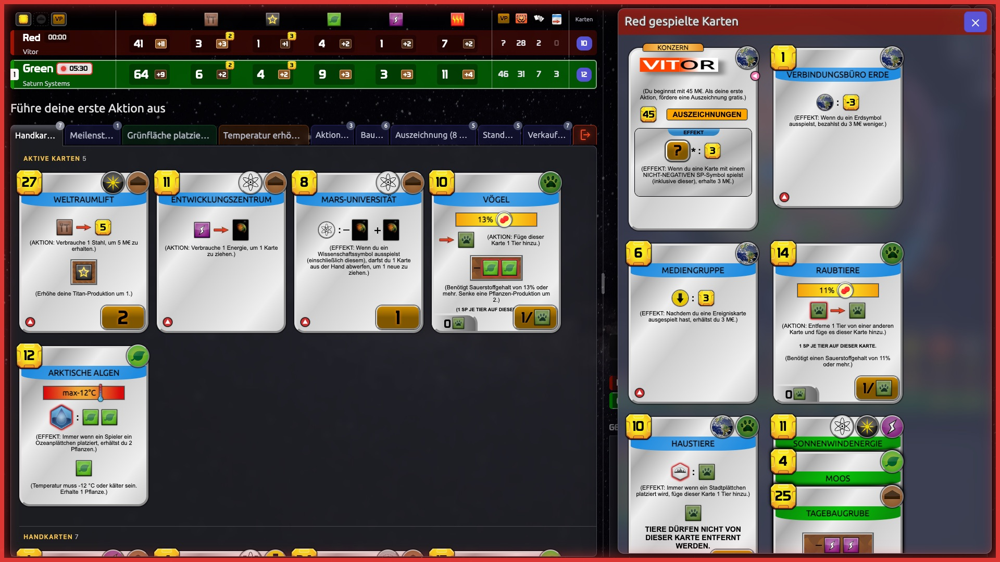

**Log:** hovering a card name shows the card next to the log.

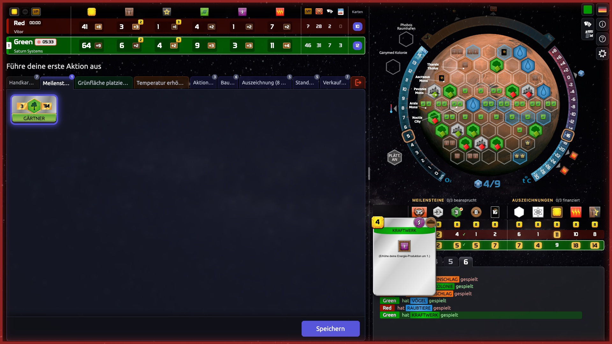

**3000 px wide:** the player table additionally shows all tags.

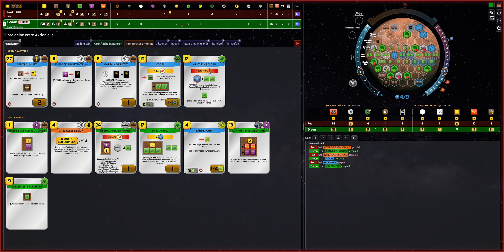

**Game end:** the notice floats over Mars, then the results page opens automatically.

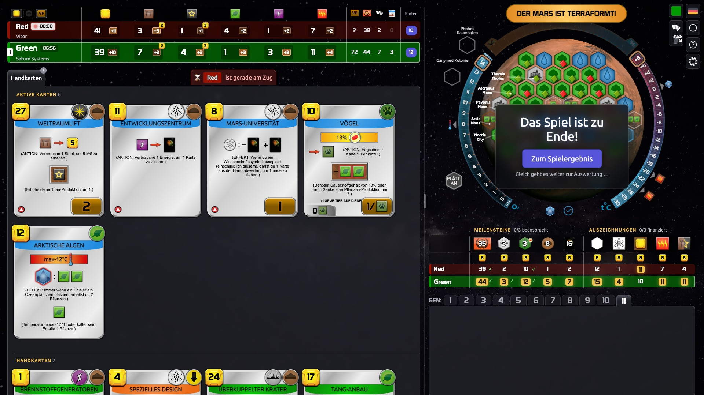

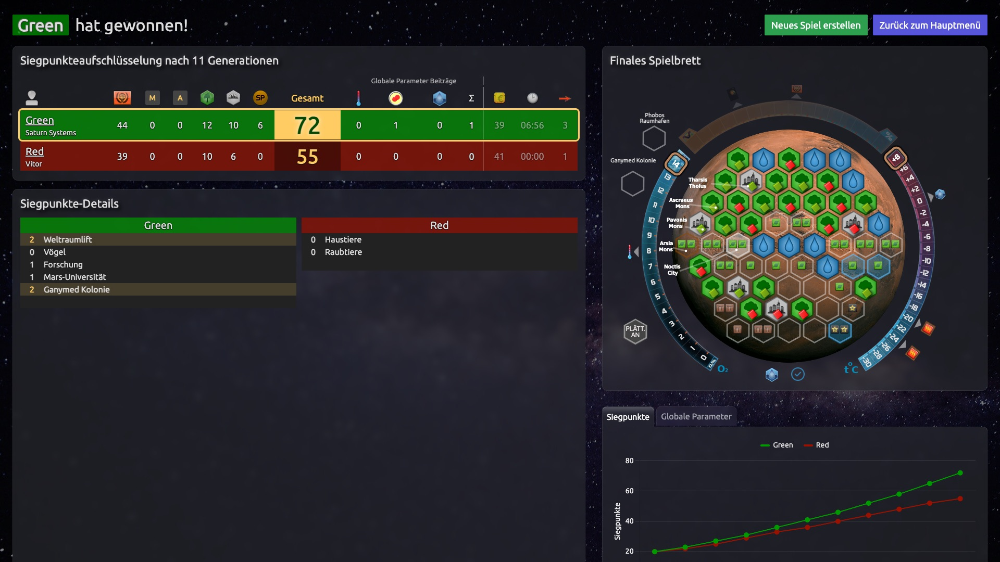

---

## Original and legal

- Game rules, cards, community and how to play: see the original [terraforming-mars/terraforming-mars](https://github.com/terraforming-mars/terraforming-mars) and [its wiki](https://github.com/terraforming-mars/terraforming-mars/wiki).
- Not affiliated with FryxGames, Asmodee Digital or Steam. The board game is great – please buy it.

## Running locally

```bash
npm install
npm run build
npm start
```

## License

GPLv3, like the original (see [LICENSE](LICENSE)).

Fonts and icons from the original:

- Russian Prototype font: https://fonts-online.ru/fonts/prototype-rus-daymarius (copyright 2001, free for personal use)
- Polish Prototype font: https://www.gry-planszowe.pl/viewtopic.php?p=1489006#p1489006 (copyright 2001, free for personal use)
- Board Game Icons: http://www.kenney.nl/ (Creative Commons Zero, CC0)
